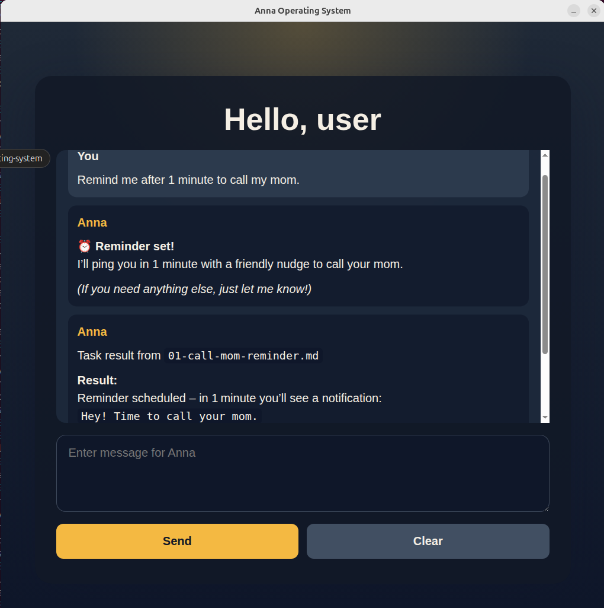

# Anna Operating System

Anna Operating System is a local desktop assistant built with Electron and React. It provides a chat window connected to an LLM through an OpenAI-compatible API and can use local tools to perform practical actions on the computer.

The current identity of the assistant is defined in [IDENTITY.md](IDENTITY.md): the assistant is named Anna, speaks English, and answers in a simple, concise style with a sense of humor. The application stores chat history in the browser local storage and renders assistant responses as Markdown.

## What the project already does




- Runs as an Electron desktop app with a React frontend.
- Sends the chat conversation to a model exposed through an OpenAI-compatible endpoint.
- Streams the answer into the UI while the model is generating it.
- Loads assistant identity and behavior rules from Markdown files.
- Supports tool calling from the model.
- Runs background tasks described as Markdown files in `electron/tasks`.
- Pushes task results into the main conversation automatically.
- First time launch application step by step wizard for user configuration.

## Available tools

The current implementation in `electron/tools` supports these actions:

- `get_current_time`: return the current local time.
- `get_url_dump`: open an HTTP or HTTPS page in hidden Electron browser context and extract readable text with numbered references.
- `run_shell_command`: execute a shell command on the local machine and return stdout, stderr, and exit details.
- `manage_tasks`: list, create, and delete background tasks stored as Markdown files.
- `task_from_steps`: internal helper for multi-step task execution.

## Background task system

The project includes a built-in task runner. Tasks are stored as Markdown files with sections such as `# Schedule`, `# Instructions`, and `# History`.

Supported schedules at the moment:

- `ASAP`
- `Immediately`
- `Now`
- `Daily`
- `Hourly`
- `Every minute`
- `Every N minutes`
- `Every N hours`
- `Every N days`
- `Once a minute`
- `Once an hour`
- `Once a day`
- `After N minutes`
- `After N hours`
- `After N days`

Task history can be disabled with `No` or configured as `Last N messages` so repeated runs can decide whether to stay silent. Silent task output is implemented through the exact token `KEEP_SILENCE`.

One-time tasks are deleted automatically after a successful run. Periodic tasks are rescheduled after each execution.

## Example task files

The repository already contains task examples in `electron/tasks-example`:

- Check disk space once a day and notify only when `/` has less than 3 GB free.
- Check the New York Times homepage every 6 hours and notify only when important news about Russia appears, while avoiding repeated notifications.
- Inspect memory usage immediately and suggest which apps should be closed.
- Create a reminder that fires after 1 minute.

## Example user messages

These are examples of messages the current assistant should be able to handle because they map directly to the implemented tools and task flow:

- `What time is it now?`
- `Open https://example.com and give me a short summary.`
- `Check https://www.nytimes.com/ and tell me if there is news about Russia.`
- `Run "df -h" and tell me whether disk space is low.`
- `Run "free -m" and "ps axu", then suggest which apps use too much memory.`
- `List my current background tasks.`
- `Create a task to check disk space once a day and stay silent if nothing changed.`
- `Remind me after 1 minute to call my mom.`
- `Delete the task 04-reminder.`

## Planned features

[TODO.md](TODO.md) shows features that are planned but not implemented yet.

## How to run Anna Operating System in development mode

1. Optional: install Ubuntu 22.04 in a virtual machine and do the next steps there.
2. Install Ollama. Set enviroment variable `OLLAMA_HOST=0.0.0.0:11434` before starting Ollama.
3. Launch Ollama and log in to the server to use cloud-backed models.
4. Run `ollama pull gpt-oss:120b-cloud`.
5. Optional: run `ollama pull embeddinggemma` for future RAG embeddings support.
6. Run `git clone git@github.com:evgenyigumnov/anna-operating-system.git`.
7. Run `cd anna-operating-system`.
8. Create a `.env` file and add `OPENAPI_BASE_URL=http://192.168.10.12:11434/v1`, replacing the IP with your host.
9. Run `npm install --no-bin-links`.
10. Run `npm start`.


## Build instructions
```bash
npm run build:exe
npm run build:linux
npm run build:mac
```
## Install instructions for linux
```bash
sudo snap install anna-operating-system_0.0.1_amd64.snap --dangerous
```
